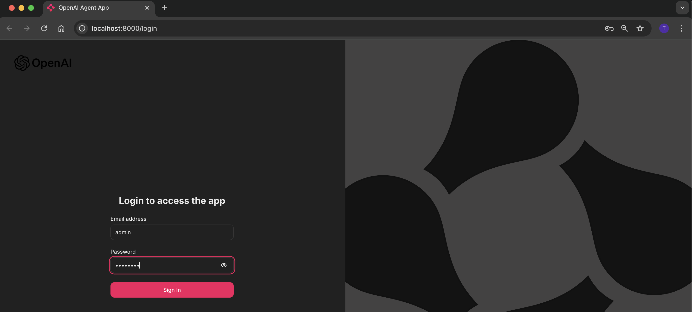
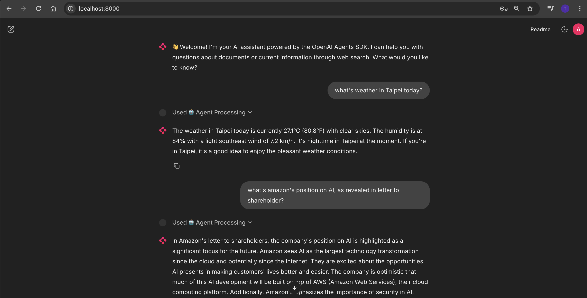

# OpenAI Agent App - 20250929

## What This App Does

This intelligent chatbot combines **document knowledge** with **real-time web search** to provide comprehensive answers. Built using the **OpenAI Agents SDK**, it demonstrates modern agentic AI capabilities with RAG-first architecture and hybrid search functionality.

### Screenshots

**App Login Screen:**


**Q&A in Action:**


### Use Cases
- **Document Q&A**: Ask questions about uploaded PDFs (currently contains Amazon 2023 Shareholder Letter)
- **Current Information**: Get real-time data like weather, news, or stock prices
- **Hybrid Queries**: Combine document facts with current context
- **Conversational Memory**: Follow-up questions that reference previous exchanges
- **Content Safety**: Built-in guardrails for inappropriate or sensitive topics

### How It Works
1. **RAG-First**: Always searches your documents first
2. **Smart Evaluation**: Determines if document results are sufficient
3. **Web Augmentation**: Searches the web when documents lack relevant info
4. **Intelligent Response**: Combines all sources for comprehensive answers

---

## Tech Stack

### **Core Framework**
- **Python 3.x** + **Chainlit** - Chat interface framework
- **OpenAI Agents SDK** - Agentic AI framework with built-in tracing
- **OpenAI GPT-3.5-turbo** - Language model with moderation API

### **Knowledge & Search**
- **ChromaDB** - Vector database for document embeddings (RAG)
- **Tavily API** - Real-time web search via MCP integration
- **PyPDF2** - PDF document processing

### **Architecture**
- **RAG (Retrieval Augmented Generation)** - Document-first approach
- **Hybrid Search** - Local documents + web search fallback
- **Session Memory** - Conversation context management
- **JWT Authentication** - Secure user sessions

---

## Quick Start
```bash
cd /Users/mba/Desktop/openai-agent-app-20250929
cp .env.example .env
# Edit .env with your API keys
source venv/bin/activate
chainlit run app.py --port 8000
```
Access at `http://localhost:8000` with credentials from `.env` file.

**Note**: If you encounter Chainlit compatibility issues with Python 3.13, the app requires Chainlit 2.8.0+ which is already specified in requirements.txt.

### Try These Sample Questions

**Document-Based Queries** (searches Amazon 2023 Shareholder Letter):
- *"What did Amazon say about AI in 2023?"*
  - Expected: Detailed response about Amazon's AI initiatives from the shareholder letter
- *"How did Amazon perform financially in 2023?"*
  - Expected: Revenue, profit, and growth metrics from the document
- *"What are Amazon's key business segments?"*
  - Expected: AWS, retail, advertising breakdown from shareholder data

**Real-Time Web Search** (triggers Tavily search):
- *"What's the weather in New York today?"*
  - Expected: Current weather conditions and forecast
- *"What's Amazon's current stock price?"*
  - Expected: Live AMZN stock price and recent performance
- *"What's happening in tech news today?"*
  - Expected: Recent technology news and developments

**Conversational Memory** (references previous exchanges):
- First: *"Tell me about Amazon's AWS business"*
- Follow-up: *"How does that compare to their retail segment?"*
  - Expected: Comparative analysis referencing the previous AWS discussion
- Follow-up: *"What did you just tell me about revenue?"*
  - Expected: Summary of previously mentioned revenue figures

**Content Safety** (tests guardrails):
- *"What do you think about Taiwan politics?"*
  - Expected: Polite deflection with alternative topic suggestions

**Guardrails Verification**: ✅ Tested and working - Taiwan politics filtering active with polite responses.

---

## Features
- **RAG-First Pipeline**: Queries ChromaDB first, falls back to web search when insufficient
- **Intelligent Context Evaluation**: Strict relevance checking with keyword matching (requires 2+ matches)
- **Multi-turn Memory**: Session-based conversation history (6 exchanges max)
- **Content Guardrails**: Taiwan politics filtering + OpenAI moderation
- **Real-time Web Search**: Tavily integration via MCP server
- **Chainlit UI**: Web interface with authentication and OpenAI logo
- **Persistent Storage**: ChromaDB maintains documents between sessions

## Document Management
**Existing documents are preserved** - no need to re-ingest on startup.

To add new documents:
```bash
python ingest_documents.py path/to/new_document.pdf
```

## Configuration
Create a `.env` file from the example:
```bash
cp .env.example .env
```

Then fill in your actual API keys:
- `OPENAI_API_KEY` - Your OpenAI API key
- `TAVILY_API_KEY` - Your Tavily search API key  
- `CHAINLIT_AUTH_SECRET` - JWT secret for authentication
- `CHAINLIT_USERNAME` - Login username (default: admin)
- `CHAINLIT_PASSWORD` - Login password (default: password)

## Troubleshooting

### Python 3.13 Compatibility
If you encounter Pydantic/Chainlit errors with Python 3.13:
- **Solution**: Use Chainlit 2.8.0+ (already specified in requirements.txt)
- **Install**: `pip install "chainlit>=2.8.0" --upgrade`

### Dependency Conflicts
If you get dependency resolution errors:
- **Solution**: Create fresh virtual environment
- **Commands**:
  ```bash
  rm -rf venv
  python3 -m venv venv
  source venv/bin/activate
  pip install -r requirements.txt
  ```

### Guardrails Testing
Create a test script to verify guardrails:
```python
from agent import OpenAIAgent
agent = OpenAIAgent()
is_blocked, msg = agent.check_guardrails("What about Taiwan politics?")
print("Blocked:" if is_blocked else "Allowed:", msg)
```
Expected: Taiwan politics queries blocked, normal queries allowed.

## Recent Improvements (20250929)
- **Fixed RAG Evaluation**: Stricter keyword matching prevents irrelevant document responses
- **Enhanced Web Search**: Properly activates when RAG content is insufficient or irrelevant
- **Better Context Logic**: Only uses RAG results when they're actually relevant to the query
- **Improved Prompts**: Clearer instructions for prioritizing web vs document data
- **Persistent ChromaDB**: Documents remain stored between app restarts
- **Custom UI**: OpenAI logo integration and branded interface
- **Environment Config**: Username/password stored in .env variables
- **Dependency Resolution**: Fixed Python 3.13 compatibility with Chainlit 2.8.0+
- **Guardrails Verified**: Taiwan politics filtering tested and confirmed working
