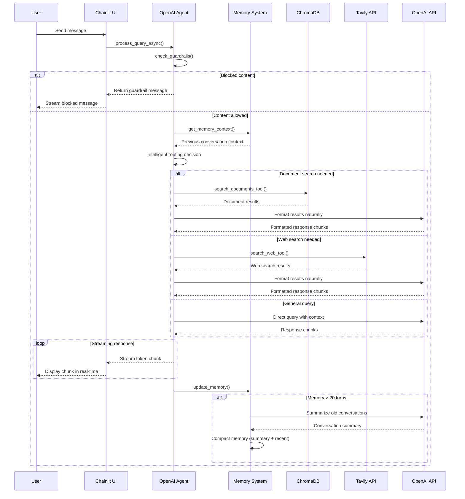

# OpenAI Agent App with RAG & Web Search

## What This App Does

This intelligent chatbot combines **document knowledge** with **real-time web search** to provide comprehensive answers. Built using the **OpenAI Agents SDK**, it demonstrates modern agentic AI capabilities with intelligent tool routing, streaming responses, and advanced memory management.

### Screenshots

**App Login Screen:**


**Q&A in Action:**


### Use Cases
- **Document Q&A**: Ask questions about uploaded PDFs (currently contains Amazon 2023 Shareholder Letter)
- **Current Information**: Get real-time data like weather, news, or stock prices with streaming responses
- **Hybrid Queries**: Combine document facts with current context
- **Extended Conversations**: Unlimited conversation length with automatic memory compaction
- **Conversational Memory**: Follow-up questions that reference previous exchanges (up to 20 turns)
- **Content Safety**: Built-in guardrails for inappropriate or sensitive topics

---

## Tech Stack

### **Core Framework**
- **Python 3.x** + **Chainlit** - Chat interface framework
- **OpenAI Agents SDK** - Official agentic AI framework with built-in tracing and async support
- **OpenAI GPT-3.5-turbo** - Language model with moderation API

### **Data & Search**
- **ChromaDB** - Vector database for document storage and retrieval
- **Tavily API** - Real-time web search for current information
- **PyPDF2** - PDF document processing
- **nest-asyncio** - Nested event loop support for async processing
- **Memory Compaction** - Automatic conversation summarization for extended sessions

### **Architecture**
- **Modular Design** - Separated memory management and guardrails into dedicated modules
- **Intelligent Tool Routing** - Automatic detection and routing between document search, web search, and general queries
- **Enhanced Keyword Detection** - Expanded patterns for better query classification
- **Streaming Response System** - Real-time token streaming with memory integration
- **Advanced Memory Management** - 20-turn history with automatic summarization and compaction
- **Content Safety Guardrails** - Dedicated module for content filtering and moderation
- **Session Memory** - Conversation context management with infinite conversation support
- **Password Authentication** - Secure user sessions with Chainlit
- **Async Event Loop** - Non-blocking processing with nest-asyncio

### **System Flow**



## 🔍 Key Implementation Details

### OpenAI Agents SDK with Intelligent Tool Routing
```python
# agent.py - OpenAI Agent with separated document and web search capabilities
from agents import Agent, Runner
from openai import OpenAI
from pdf_processor import query_chroma
from mcp_server import MCPTavilyServer

class OpenAIAgentSDK:
    def __init__(self):
        self.client = OpenAI(api_key=os.getenv("OPENAI_API_KEY"))
        self.mcp_server = MCPTavilyServer()
        
        # Initialize memory and guardrails managers
        self.memory_manager = MemoryManager(self.client)
        self.guardrails_manager = GuardrailsManager(self.client)
        
        # Initialize OpenAI Agent SDK
        self.agent = Agent(
            name="RAG-Web-Search-Agent",
            model="gpt-3.5-turbo",
            instructions="""You are an intelligent assistant that combines document knowledge with real-time web search.
            
            Your capabilities:
            1. Answer questions using your knowledge
            2. Maintain conversation context
            3. Apply content safety guardrails"""
        )
```

### Document Search Tool (ChromaDB/RAG)
```python
# agent.py - Internal document search for uploaded PDFs
def search_documents_tool(self, query: str) -> str:
    """Search ChromaDB for document information"""
    try:
        results = query_chroma(query)
        if results and len(results) > 0:
            return f"Document search results: {results}"
        return "No relevant documents found."
    except Exception as e:
        return f"Document search error: {str(e)}"

# pdf_processor.py - ChromaDB vector database setup
def setup_chromadb():
    db_path = "./chroma_db"
    os.makedirs(db_path, exist_ok=True)
    
    client = chromadb.PersistentClient(path=db_path)
    collection = client.get_or_create_collection("documents")
    return collection

def query_chroma(query, n_results=3):
    """Query ChromaDB for relevant documents"""
    collection = setup_chromadb()
    results = collection.query(query_texts=[query], n_results=n_results)
    return results['documents'][0] if results['documents'] else []
```

### Web Search Tool (Tavily/MCP)
```python
# agent.py - External web search for current information
def search_web_tool(self, query: str) -> str:
    """Search the web for current information"""
    try:
        results = self.mcp_server.search_web(query, max_results=3)
        if results:
            formatted_results = []
            for result in results:
                title = result.get('title', 'No title')
                content = result.get('content', 'No content')
                url = result.get('url', 'No URL')
                formatted_results.append(f"**{title}**\n{content}\nSource: {url}")
            return "\n\n".join(formatted_results)
        return "No web search results found."
    except Exception as e:
        return f"Web search error: {str(e)}"

# mcp_server.py - Tavily API integration
class MCPTavilyServer:
    def __init__(self):
        self.client = TavilyClient(api_key=os.getenv("TAVILY_API_KEY"))
    
    def search_web(self, query, max_results=3):
        response = self.client.search(query=query, max_results=max_results)
        return response.get("results", [])
```

### Chainlit Authentication & Streaming Interface
```python
# app.py - Password authentication and streaming responses
@cl.password_auth_callback
def auth_callback(username: str, password: str):
    if username == os.getenv("CHAINLIT_USERNAME") and password == os.getenv("CHAINLIT_PASSWORD"):
        return cl.User(identifier="admin", metadata={"role": "admin"})
    return None

@cl.on_message
async def main(message: cl.Message):
    session_id = cl.user_session.get("session_id", "default")
    
    # Create empty message for streaming
    msg = cl.Message(content="")
    await msg.send()
    
    # Stream response in real-time
    full_response = ""
    async for chunk in agent.stream_response_async(message.content, session_id):
        full_response += chunk
        await msg.stream_token(chunk)
    
    await msg.update()
```

### Advanced Memory Management & Guardrails
```python
# memory_manager.py - Conversation memory with automatic compaction
class MemoryManager:
    def __init__(self, openai_client: OpenAI):
        self.client = openai_client
        self.conversation_memory = {}
        self.max_exchanges = 20
        self.keep_recent = 5
    
    def update_memory(self, session_id: str, user_query: str, response: str):
        """Update conversation memory with automatic summarization"""
        if session_id not in self.conversation_memory:
            self.conversation_memory[session_id] = []
        
        self.conversation_memory[session_id].append({
            'user': user_query,
            'assistant': response,
            'timestamp': time.time()
        })
        
        # Auto-compact if memory exceeds max exchanges
        if len(self.conversation_memory[session_id]) >= self.max_exchanges:
            self._compact_memory(session_id)

# guardrails.py - Content safety guardrails implementation
class GuardrailsManager:
    def __init__(self, openai_client: OpenAI):
        self.client = openai_client
        self.taiwan_politics_keywords = [
            'taiwan politics', 'taiwan independence', 'cross-strait',
            'taiwan election', 'dpp', 'kmt', 'taiwan president'
        ]
    
    def check_guardrails(self, user_query: str) -> Tuple[bool, Optional[str]]:
        """Enhanced guardrails for inappropriate content and Taiwan politics"""
        query_lower = user_query.lower()
        
        # Check for Taiwan politics
        if any(keyword in query_lower for keyword in self.taiwan_politics_keywords):
            return True, "I appreciate your interest, but I prefer to focus on other topics. How can I help you with something else?"
        
        # Check OpenAI moderation for abusive content
        try:
            moderation = self.client.moderations.create(input=user_query)
            result = moderation.results[0]
            return result.flagged, self.moderation_response if result.flagged else None
        except:
            return False, None

# agent.py - Refactored to use modular components
class OpenAIAgentSDK:
    def __init__(self):
        self.client = OpenAI(api_key=os.getenv("OPENAI_API_KEY"))
        self.mcp_server = MCPTavilyServer()
        
        # Initialize memory and guardrails managers
        self.memory_manager = MemoryManager(self.client)
        self.guardrails_manager = GuardrailsManager(self.client)
```

## 🧪 Testing & Troubleshooting

### Basic Test Commands
```bash
python ingest_documents.py          # Load PDFs into ChromaDB
chainlit run app.py                 # Start the application
python test_refactored_agent.py     # Test all refactored modules
python -c "from agent import OpenAIAgentSDK; agent = OpenAIAgentSDK(); print('Agent initialized successfully')"
```

### Memory Management Testing
```python
# Test memory functionality separately
from memory_manager import MemoryManager
from openai import OpenAI

client = OpenAI(api_key="your-key")
memory = MemoryManager(client)

# Test basic memory operations
memory.update_memory("test_session", "Hello", "Hi there!")
context = memory.get_memory_context("test_session")
stats = memory.get_session_stats("test_session")

print(f"Memory context: {context}")
print(f"Session stats: {stats}")

# Test memory compaction (simulate 20+ exchanges)
for i in range(25):
    memory.update_memory("test_session", f"Question {i}", f"Answer {i}")

# Check if compaction occurred
final_stats = memory.get_session_stats("test_session")
print(f"After compaction - Exchanges: {final_stats['total_exchanges']}")
```

### Guardrails Testing
```python
# Test guardrails functionality separately
from guardrails import GuardrailsManager
from openai import OpenAI

client = OpenAI(api_key="your-key")
guardrails = GuardrailsManager(client)

# Test Taiwan politics filtering
test_queries = [
    "Tell me about Taiwan politics",     # Should be blocked
    "Taiwan independence movement",      # Should be blocked
    "What's the weather like today?",    # Should be allowed
    "How does machine learning work?"    # Should be allowed
]

for query in test_queries:
    is_blocked, response = guardrails.check_guardrails(query)
    status = "BLOCKED" if is_blocked else "ALLOWED"
    print(f"Query: '{query}' -> {status}")
    if response:
        print(f"Response: {response}")
    print()

# Test OpenAI moderation integration
offensive_query = "This is inappropriate content"  # Replace with actual test
is_blocked, response = guardrails.check_guardrails(offensive_query)
print(f"Moderation test - Blocked: {is_blocked}")
```

### Integration Testing
```python
# Test full agent with both memory and guardrails
from agent import OpenAIAgentSDK

agent = OpenAIAgentSDK()

# Test conversation flow with memory
session_id = "integration_test"
queries = [
    "What did Amazon say about AI in 2023?",
    "How does that compare to their retail business?",  # Tests memory
    "Taiwan politics discussion"  # Tests guardrails
]

for query in queries:
    print(f"\nTesting: {query}")
    # This would normally be async, but for testing:
    response = agent.process_query(query, session_id)
    print(f"Response: {response[:100]}...")
```

### Common Issues & Troubleshooting

#### Application Issues
- **ChromaDB Empty**: Run `python ingest_documents.py` to load documents
- **Streaming Not Working**: Check nest-asyncio installation and async event loop
- **Authentication Failed**: Verify CHAINLIT_USERNAME and CHAINLIT_PASSWORD in `.env`
- **API Errors**: Confirm OPENAI_API_KEY and TAVILY_API_KEY are valid
- **Module Import Errors**: Ensure all modules (memory_manager.py, guardrails.py) are in the same directory

#### Memory Management Issues
- **Memory Not Persisting**: Check if session_id is consistent across requests
- **Compaction Not Working**: Verify OpenAI API key for summarization calls
- **Memory Overflow**: Check if max_exchanges limit is properly configured (default: 20)

#### Guardrails Issues
- **Taiwan Politics Not Blocked**: Verify keywords in GuardrailsManager.taiwan_politics_keywords
- **Moderation API Failing**: Check OpenAI API key and moderation endpoint access
- **False Positives**: Review and adjust keyword patterns in guardrails.py

#### Debug Commands
```bash
# Check ChromaDB contents
python -c "from pdf_processor import setup_chromadb; collection = setup_chromadb(); print(f'Documents: {collection.count()}')"

# Test API connections
python -c "from openai import OpenAI; client = OpenAI(); print('OpenAI API: OK')"
python -c "from mcp_server import MCPTavilyServer; server = MCPTavilyServer(); print('Tavily API: OK')"

# Verify module imports
python -c "from memory_manager import MemoryManager; from guardrails import GuardrailsManager; print('Modules: OK')"
```

## 📁 Project Structure

```
openai-agent-app-20250929/
├── README.md                        # Project documentation
├── REFACTORING_SUMMARY.md           # Detailed refactoring changes
├── DOCUMENTATION_VALIDATION.md      # Documentation accuracy report
├── screenshots/                     # App screenshots
│   ├── screenshot_1.png            # App Login
│   └── screenshot_2.png            # Q&A in Action
├── agent.py                        # Main OpenAI Agent (refactored)
├── memory_manager.py               # Memory management module
├── guardrails.py                   # Content safety module
├── app.py                          # Chainlit web interface
├── pdf_processor.py                # ChromaDB document processing
├── mcp_server.py                   # Tavily web search integration
├── ingest_documents.py             # Document ingestion utility
├── test_refactored_agent.py        # Test script for refactored modules
├── requirements.txt                # Python dependencies
├── .env.example                    # Environment template
├── .gitignore                      # Git ignore rules
├── chainlit.md                     # Chainlit welcome message
└── chroma_db/                      # Vector database storage (created at runtime)

Note: venv/ directory will be created when you run the installation commands
```

---

## Quick Start
```bash
# Clone or navigate to the project directory
cd openai-agent-app-20250929

# Copy environment template and configure
cp .env.example .env
# Edit .env with your API keys

# Activate virtual environment and install dependencies
source venv/bin/activate  # On Windows: venv\Scripts\activate
pip install -r requirements.txt

# Start the application
chainlit run app.py --port 8000
```
Access at `http://localhost:8000` with credentials from `.env` file.

**Note**: If you encounter Chainlit compatibility issues with Python 3.13, the app requires Chainlit 2.8.0+ which is already specified in requirements.txt.

### Try These Sample Questions

**Document-Based Queries** (searches Amazon 2023 Shareholder Letter):
- *"What did Amazon say about AI in 2023?"*
  - Expected: Detailed response about Amazon's AI initiatives from the shareholder letter
- *"How did Amazon perform financially in 2023?"*
  - Expected: Revenue, profit, and growth metrics from the document
- *"What are Amazon's key business segments?"*
  - Expected: AWS, retail, advertising breakdown from shareholder data

**Real-Time Web Search** (triggers Tavily search):
- *"What's the weather in New York today?"*
  - Expected: Current weather conditions and forecast
- *"What's Amazon's current stock price?"*
  - Expected: Live AMZN stock price and recent performance
- *"What's happening in tech news today?"*
  - Expected: Recent technology news and developments
- *"What's the temperature in Tokyo?"*
  - Expected: Current temperature and weather conditions

**Conversational Memory** (references previous exchanges):
- First: *"Tell me about Amazon's AWS business"*
- Follow-up: *"How does that compare to their retail segment?"*
  - Expected: Comparative analysis referencing the previous AWS discussion
- Follow-up: *"What did you just tell me about revenue?"*
  - Expected: Summary of previously mentioned revenue figures
- **Extended Memory**: Supports up to 20 conversation turns with automatic summarization
- **Memory Compaction**: After 20 turns, older conversations are summarized to maintain context while preserving recent exchanges

**Content Safety** (tests guardrails):
- *"What do you think about Taiwan politics?"*
  - Expected: Polite deflection with alternative topic suggestions

**Guardrails Verification**: ✅ Tested and working - Taiwan politics filtering active with polite responses.

---

## Features
- **Modular Architecture**: Separated memory management and guardrails into dedicated modules for better maintainability
- **OpenAI Agents SDK Integration**: Official agent framework with built-in tracing and async processing
- **Intelligent Tool Routing**: Automatic detection and routing between document search, web search, and general queries
- **Enhanced Keyword Detection**: Expanded patterns for weather, news, financial, and document queries
- **Streaming Responses**: Real-time token streaming for immediate user feedback and better UX
- **Advanced Memory System**: 20-turn conversation history with automatic summarization and compaction
- **Content Safety Guardrails**: Dedicated module with Taiwan politics filtering + OpenAI moderation
- **Async Processing**: Non-blocking query processing with visual indicators using nest-asyncio
- **Real-time Web Search**: Tavily integration for current information (weather, news, stock prices)
- **Document Search**: ChromaDB vector search for uploaded PDFs (Amazon 2023 Shareholder Letter)
- **Chainlit UI**: Web interface with password authentication
- **Persistent Storage**: ChromaDB maintains documents between sessions

## Document Management
**Existing documents are preserved** - no need to re-ingest on startup.

To add new documents:
```bash
python ingest_documents.py path/to/new_document.pdf
```

## Configuration
Create a `.env` file from the example:
```bash
cp .env.example .env
```

Then fill in your actual API keys:
- `OPENAI_API_KEY` - Your OpenAI API key
- `TAVILY_API_KEY` - Your Tavily search API key  
- `CHAINLIT_AUTH_SECRET` - Secret for authentication (can be any random string)
- `CHAINLIT_USERNAME` - Login username
- `CHAINLIT_PASSWORD` - Login password

## Installation
```bash
python -m venv venv
source venv/bin/activate  # On Windows: venv\Scripts\activate
pip install -r requirements.txt
```

### Quick Guardrails Verification
Test the content safety system:
```python
from agent import OpenAIAgentSDK
agent = OpenAIAgentSDK()

# Test blocked content
is_blocked, msg = agent.guardrails_manager.check_guardrails("What about Taiwan politics?")
print("Blocked:" if is_blocked else "Allowed:", msg)

# Test allowed content  
is_blocked, msg = agent.guardrails_manager.check_guardrails("How does machine learning work?")
print("Blocked:" if is_blocked else "Allowed:", msg or "Query allowed")
```
Expected: Taiwan politics queries blocked with polite responses, normal queries allowed.

## Recent Improvements (20250929)
- ✅ **Modular Architecture**: Refactored codebase with separate memory_manager.py and guardrails.py modules
- ✅ **OpenAI Agents SDK Integration**: Migrated from custom agent to official OpenAI Agents SDK
- ✅ **Enhanced Testing**: Added comprehensive test suite for refactored modules
- ✅ **Streaming Responses**: Real-time token streaming for immediate user feedback and better UX
- ✅ **Advanced Memory System**: Extended to 20-turn conversation history with automatic summarization
- ✅ **Memory Compaction**: Automatic conversation summarization after 20 turns to maintain context
- ✅ **Improved Maintainability**: Separated concerns for better code organization and testing
- ✅ **Intelligent Tool Routing**: Automatic detection and routing between document search, web search, and general queries
- ✅ **Polished Responses**: Natural language formatting of search results using OpenAI
- ✅ **Enhanced Keyword Detection**: Expanded patterns for better query classification
- ✅ **Built-in Tracing**: Automatic execution tracing from OpenAI Agents SDK
- ✅ **Enhanced UI**: Processing indicators and step-by-step execution visibility
- ✅ **Code Cleanup**: Removed interim artifacts and consolidated to final implementation

---

## License
MIT License - Feel free to use and modify for your projects!
