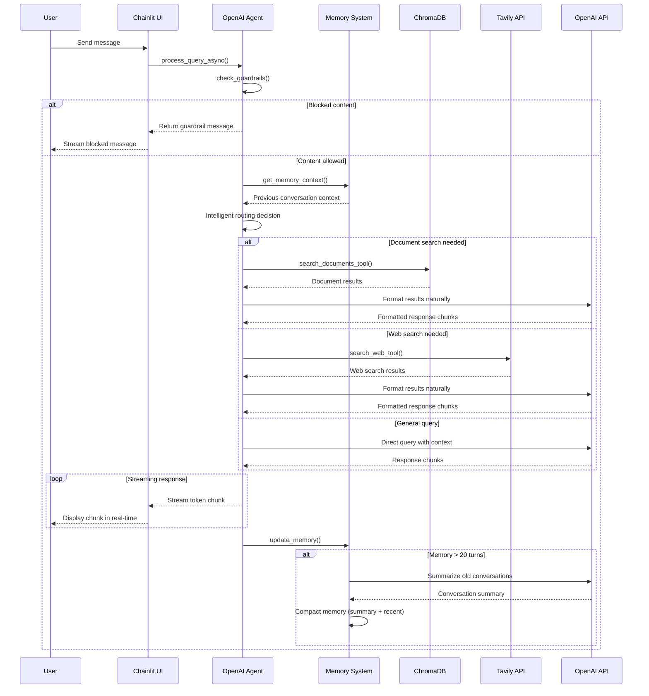

# OpenAI Agent App with RAG & Web Search

## Overview

This intelligent chatbot combines **document knowledge** with **real-time web search** to provide comprehensive answers. Built using the **OpenAI Agents SDK**, it demonstrates modern agentic AI capabilities with intelligent tool routing, streaming responses, and advanced memory management.

### Key Features
- **RAG-First Pipeline**: Searches documents first, then web when needed
- **Intelligent Tool Routing**: Automatic detection between document search, web search, and general queries
- **Advanced Memory System**: 20-turn conversation history with automatic summarization and compaction
- **Content Safety Guardrails**: Taiwan politics filtering + OpenAI moderation
- **Streaming Responses**: Real-time token streaming for immediate user feedback
- **Modular Architecture**: Separated memory management and guardrails into dedicated modules

### Screenshots


---

## 🚀 Setup & Installation

### 1. Environment Setup
```bash
# Clone or navigate to the project directory
cd openai-agent-app-20250929

# Create and activate virtual environment
python -m venv venv
source venv/bin/activate  # On Windows: venv\Scripts\activate

# Install dependencies
pip install -r requirements.txt
```

### 2. Configuration
```bash
# Copy environment template
cp .env.example .env
# Edit .env with your API keys
```

**Required API Keys:**
- `OPENAI_API_KEY` - Your OpenAI API key
- `TAVILY_API_KEY` - Your Tavily search API key  
- `CHAINLIT_AUTH_SECRET` - Secret for authentication (any random string)
- `CHAINLIT_USERNAME` - Login username (default: admin)
- `CHAINLIT_PASSWORD` - Login password (default: password)

### 3. Start Application
```bash
chainlit run app.py --port 8000
```
Access at `http://localhost:8000` with your configured credentials.

**Note**: Requires Chainlit 2.8.0+ for Python 3.13 compatibility (already in requirements.txt).

### Try These Sample Questions

**Document Queries** (Amazon 2023 Shareholder Letter):
- *"What did Amazon say about AI in 2023?"*
- *"How did Amazon perform financially in 2023?"*

**Web Search** (real-time information):
- *"What's the weather in New York today?"*
- *"What's Amazon's current stock price?"*

**Memory & Safety**:
- Follow-up: *"How does that compare to their retail segment?"*
- Blocked: *"What do you think about Taiwan politics?"*

---

## Tech Stack

**Core Framework:**
- **Python 3.x** + **Chainlit** - Chat interface framework
- **OpenAI Agents SDK** - Official agentic AI framework with built-in tracing
- **OpenAI GPT-3.5-turbo** - Language model with moderation API

**Data & Search:**
- **ChromaDB** - Vector database for document storage and retrieval
- **Tavily API** - Real-time web search for current information
- **PyPDF2** - PDF document processing
- **nest-asyncio** - Nested event loop support for async processing

---



## 🔍 Key Implementation Details

### OpenAI Agents SDK with Intelligent Tool Routing
```python
# agent.py - OpenAI Agent with separated document and web search capabilities
from agents import Agent, Runner
from openai import OpenAI
from pdf_processor import query_chroma
from mcp_server import MCPTavilyServer

class OpenAIAgentSDK:
    def __init__(self):
        self.client = OpenAI(api_key=os.getenv("OPENAI_API_KEY"))
        self.mcp_server = MCPTavilyServer()
        
        # Initialize memory and guardrails managers
        self.memory_manager = MemoryManager(self.client)
        self.guardrails_manager = GuardrailsManager(self.client)
        
        # Initialize OpenAI Agent SDK
        self.agent = Agent(
            name="RAG-Web-Search-Agent",
            model="gpt-3.5-turbo",
            instructions="""You are an intelligent assistant that combines document knowledge with real-time web search.
            
            Your capabilities:
            1. Answer questions using your knowledge
            2. Maintain conversation context
            3. Apply content safety guardrails"""
        )
```

### Document Search Tool (ChromaDB/RAG)
```python
# agent.py - Internal document search for uploaded PDFs
def search_documents_tool(self, query: str) -> str:
    """Search ChromaDB for document information"""
    try:
        results = query_chroma(query)
        if results and len(results) > 0:
            return f"Document search results: {results}"
        return "No relevant documents found."
    except Exception as e:
        return f"Document search error: {str(e)}"

# pdf_processor.py - ChromaDB vector database setup
def setup_chromadb():
    db_path = "./chroma_db"
    os.makedirs(db_path, exist_ok=True)
    
    client = chromadb.PersistentClient(path=db_path)
    collection = client.get_or_create_collection("documents")
    return collection

def query_chroma(query, n_results=3):
    """Query ChromaDB for relevant documents"""
    collection = setup_chromadb()
    results = collection.query(query_texts=[query], n_results=n_results)
    return results['documents'][0] if results['documents'] else []
```

### Web Search Tool (Tavily/MCP)
```python
# agent.py - External web search for current information
def search_web_tool(self, query: str) -> str:
    """Search the web for current information"""
    try:
        results = self.mcp_server.search_web(query, max_results=3)
        if results:
            formatted_results = []
            for result in results:
                title = result.get('title', 'No title')
                content = result.get('content', 'No content')
                url = result.get('url', 'No URL')
                formatted_results.append(f"**{title}**\n{content}\nSource: {url}")
            return "\n\n".join(formatted_results)
        return "No web search results found."
    except Exception as e:
        return f"Web search error: {str(e)}"

# mcp_server.py - Tavily API integration
class MCPTavilyServer:
    def __init__(self):
        self.client = TavilyClient(api_key=os.getenv("TAVILY_API_KEY"))
    
    def search_web(self, query, max_results=3):
        response = self.client.search(query=query, max_results=max_results)
        return response.get("results", [])
```

### Chainlit Authentication & Streaming Interface
```python
# app.py - Password authentication and streaming responses
@cl.password_auth_callback
def auth_callback(username: str, password: str):
    if username == os.getenv("CHAINLIT_USERNAME") and password == os.getenv("CHAINLIT_PASSWORD"):
        return cl.User(identifier="admin", metadata={"role": "admin"})
    return None

@cl.on_message
async def main(message: cl.Message):
    session_id = cl.user_session.get("session_id", "default")
    
    # Create empty message for streaming
    msg = cl.Message(content="")
    await msg.send()
    
    # Stream response in real-time
    full_response = ""
    async for chunk in agent.stream_response_async(message.content, session_id):
        full_response += chunk
        await msg.stream_token(chunk)
    
    await msg.update()
```

### Advanced Memory Management
```python
# memory_manager.py - Conversation memory with automatic compaction
class MemoryManager:
    def __init__(self, openai_client: OpenAI):
        self.client = openai_client
        self.conversation_memory = {}
        self.max_exchanges = 20
        self.keep_recent = 5
    
    def update_memory(self, session_id: str, user_query: str, response: str):
        """Update conversation memory with automatic summarization"""
        if session_id not in self.conversation_memory:
            self.conversation_memory[session_id] = []
        
        self.conversation_memory[session_id].append({
            'user': user_query,
            'assistant': response,
            'timestamp': time.time()
        })
        
        # Auto-compact if memory exceeds max exchanges
        if len(self.conversation_memory[session_id]) >= self.max_exchanges:
            self._compact_memory(session_id)
    
    def get_memory_context(self, session_id: str) -> str:
        """Get formatted conversation context for the session"""
        if session_id not in self.conversation_memory:
            return ""
        
        context_parts = []
        for exchange in self.conversation_memory[session_id]:
            context_parts.append(f"User: {exchange['user']}")
            context_parts.append(f"Assistant: {exchange['assistant']}")
        
        return "\n".join(context_parts)
```

### Content Safety Guardrails
```python
# guardrails.py - Content safety guardrails implementation
class GuardrailsManager:
    def __init__(self, openai_client: OpenAI):
        self.client = openai_client
        self.taiwan_politics_keywords = [
            'taiwan politics', 'taiwan independence', 'cross-strait',
            'taiwan election', 'dpp', 'kmt', 'taiwan president'
        ]
        self.moderation_response = "I can't assist with that type of content. Let me help you with something else."
    
    def check_guardrails(self, user_query: str) -> Tuple[bool, Optional[str]]:
        """Enhanced guardrails for inappropriate content and Taiwan politics"""
        query_lower = user_query.lower()
        
        # Check for Taiwan politics
        if any(keyword in query_lower for keyword in self.taiwan_politics_keywords):
            return True, "I appreciate your interest, but I prefer to focus on other topics. How can I help you with something else?"
        
        # Check OpenAI moderation for abusive content
        try:
            moderation = self.client.moderations.create(input=user_query)
            result = moderation.results[0]
            return result.flagged, self.moderation_response if result.flagged else None
        except:
            return False, None
```

### Modular Integration
```python
# agent.py - Integration of memory and guardrails managers
class OpenAIAgentSDK:
    def __init__(self):
        self.client = OpenAI(api_key=os.getenv("OPENAI_API_KEY"))
        self.mcp_server = MCPTavilyServer()
        
        # Initialize memory and guardrails managers
        self.memory_manager = MemoryManager(self.client)
        self.guardrails_manager = GuardrailsManager(self.client)
```

## 🔧 Troubleshooting

### Common Issues & Solutions

#### Application Issues
- **ChromaDB Empty**: Run `python ingest_documents.py` to load documents
- **Streaming Not Working**: Check nest-asyncio installation and async event loop
- **Authentication Failed**: Verify CHAINLIT_USERNAME and CHAINLIT_PASSWORD in `.env`
- **API Errors**: Confirm OPENAI_API_KEY and TAVILY_API_KEY are valid
- **Module Import Errors**: Ensure all modules (memory_manager.py, guardrails.py) are in the same directory

#### Memory Management Issues
- **Memory Not Persisting**: Check if session_id is consistent across requests
- **Compaction Not Working**: Verify OpenAI API key for summarization calls
- **Memory Overflow**: Check if max_exchanges limit is properly configured (default: 20)

#### Guardrails Issues
- **Taiwan Politics Not Blocked**: Verify keywords in GuardrailsManager.taiwan_politics_keywords
- **Moderation API Failing**: Check OpenAI API key and moderation endpoint access
- **False Positives**: Review and adjust keyword patterns in guardrails.py

#### Debug Commands
```bash
# Check ChromaDB contents
python -c "from pdf_processor import setup_chromadb; collection = setup_chromadb(); print(f'Documents: {collection.count()}')"

# Test API connections
python -c "from openai import OpenAI; client = OpenAI(); print('OpenAI API: OK')"
python -c "from mcp_server import MCPTavilyServer; server = MCPTavilyServer(); print('Tavily API: OK')"

# Verify module imports
python -c "from memory_manager import MemoryManager; from guardrails import GuardrailsManager; print('Modules: OK')"
```

## 📁 Project Structure

```
openai-agent-app-20250929/
├── .chainlit/                      # Chainlit configuration
│   └── config.toml                 # UI customization (removes footer message)
├── README.md                        # Project documentation
├── REFACTORING_SUMMARY.md           # Detailed refactoring changes
├── DOCUMENTATION_VALIDATION.md      # Documentation accuracy report
├── screenshots/                     # App screenshots
│   ├── screenshot_1.png            # App Login
│   └── screenshot_2.png            # Q&A in Action
├── agent.py                        # Main OpenAI Agent (refactored)
├── memory_manager.py               # Memory management module
├── guardrails.py                   # Content safety module
├── app.py                          # Chainlit web interface
├── pdf_processor.py                # ChromaDB document processing
├── mcp_server.py                   # Tavily web search integration
├── ingest_documents.py             # Document ingestion utility
├── test_refactored_agent.py        # Test script for refactored modules
├── requirements.txt                # Python dependencies
├── .env.example                    # Environment template
├── .gitignore                      # Git ignore rules
├── chainlit.md                     # Chainlit welcome message
└── chroma_db/                      # Vector database storage (created at runtime)

Note: venv/ directory will be created when you run the installation commands
```

---

## 🚀 Setup & Installation

### 1. Environment Setup
```bash
# Clone or navigate to the project directory
cd openai-agent-app-20250929

# Create and activate virtual environment
python -m venv venv
source venv/bin/activate  # On Windows: venv\Scripts\activate

# Install dependencies
pip install -r requirements.txt
```

### 2. Configuration
```bash
# Copy environment template
cp .env.example .env
# Edit .env with your API keys
```

**Required API Keys:**
- `OPENAI_API_KEY` - Your OpenAI API key
- `TAVILY_API_KEY` - Your Tavily search API key  
- `CHAINLIT_AUTH_SECRET` - Secret for authentication (any random string)
- `CHAINLIT_USERNAME` - Login username (default: admin)
- `CHAINLIT_PASSWORD` - Login password (default: password)

### 3. Start Application
```bash
chainlit run app.py --port 8000
```
Access at `http://localhost:8000` with your configured credentials.

## Document Management
**Existing documents are preserved** - no need to re-ingest on startup.

To add new documents:
```bash
python ingest_documents.py path/to/new_document.pdf
```

---

## License
MIT License - Feel free to use and modify for your projects!
